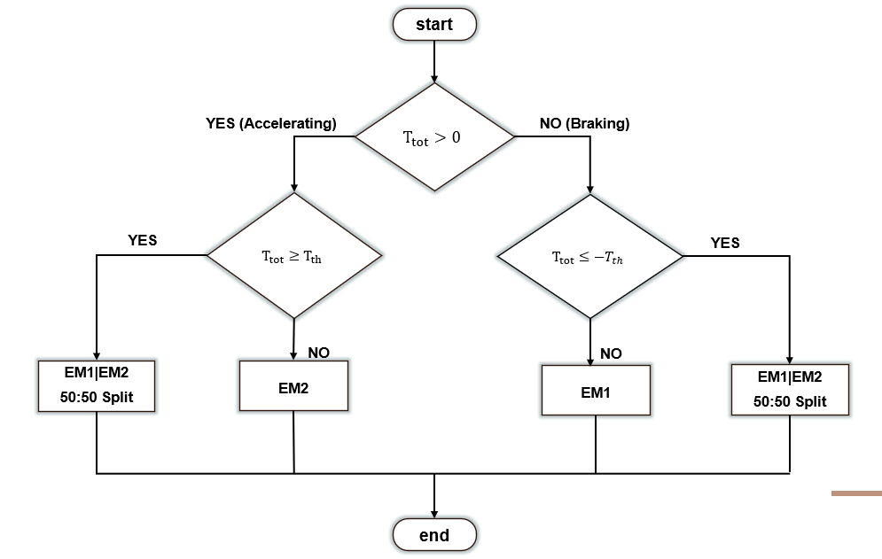

# Energy Management for a Dual Motor Battery Electric Vehicle using Model Predictive Control
In this project, two separate strategy was deployed with the second building upon the first. 

First nonlinear model predictive controller is designed to optimally distribute torque in a 2 motor battery electric vehicle. This performs a 50:50 split of the torque supplied by the motors. 

Secondly, the nonlinear model predictive controller was augmented with rule-based logic which further processed the optimal torque produced by the MPC controller.
Results show that the MPC controller by equally spliting the torque improved the efficiency of the BEV on simulation with the WLTP Class 3, FTP75 and US06 drive cycles by 1.12%, 8.36% and 1.7% respectively. There was a reduction in controller performance by 1.35% of battery state of charge compared to the baseline in the HWFET drive cycle.

However on incorporating the rule-based logic with the MPC, the controller performance lead to increased efficiency in all the drive cycles by 3.25%, 8.86% and 3.55% for the WLTP Class 3, FTP75 and US06 respectively. This time there was also a 0.18% in HWFET drive cycle.

Compared to the baseline controller, While MPC strategy alone performed well in urban and/or aggressive drive cycle it didn't in highway/constant speed drive cycles. However, a combination of MPC and a rule-based approach showed improvements in all drive cycle.

## Model Description
The vehicle model is based on MathWork's "Electric Vehicle 2EM" Reference application. See the link for detailed description of the model [EV Reference Application](https://uk.mathworks.com/help/autoblks/ug/electric-vehicle-reference-application.html).

Figure 1: Electric Vehicle Architecture[3}

## Prediction Model
The prediction model is the two states, two inputs and one output model state function. The states are the speed (in m/s) and battery state of charge (in Ah). The inputs are the torque supplied by the two electric motors and the output is the speed of the vehicle. The speed is the prediction model output due to the tracking requirement of the controller.

where the inputs: u1 = Tem1 ;    u2 = Tem2. 

The states of the model are speed, (veh) and battery state of charge (SOC).

## Cost Function
This is specified as a scalar which penalizes deviation from the output reference values (tracking) and minimizes the control effort. Below is the discretized cost function:

Where xref is the reference trajectory of the vehicle which contains the drive cycle information, Q and R are weighting matrices for penalizing deviation from the reference signal and control effort minimization respectively. x and u are the state and input vectors respectively.

## Constraints
The constraints are made of hard input constraints determined by the motor specification, slip ratio and normal load on the wheels. The slip ratio and normal load constraints are implicit to the prediction model. Hence it will be shown analytically that they are not violated and confirmed from simulation results.

### Input Constraints
This includes constraints on the torque command to powertrain transmission
ui,min ≤ ui(k) ≤ ui,max    ∀k=0,1,2…p

Where u1,min = -450 Nm and u1,max= 450 Nm ; u2,min= -450 Nm and u2,max= 450 Nm.
      
Where u1 =  Tem1 and u2 =  Tem2 

### Normal load (Fz) Constraint

See report section 4.1.2 for the analytical proof which shows that the constraints will not be violated given the prediction model and current formulation. Also see results section 5.5 and 5.7 to see the results from simulation.

### Slip ratio (&sigma;) Constraint
See report section 4.1.2 for the analytical proof which shows that the constraints will not be violated given the prediction model and current formulation. Also see results section 5.5 and 5.7 to see the results from simulation.

## Solver
The C/GMRES solver is used to solve the nonlinear MPC problem at each time step.

## Rule-based Logic
This is implemented as an if-else logic.  See its implementation in the Matlab function (Torque_Constraints) See figure 2 below for its description. Note that - Tth represents the Torque threshold where the driving mode switches from single to dual motor propelling or braking the vehicle motion. Ttot is the optimal torque computed at each time step from the nonlinear MPC controller.

Figure 2: Rule-based Logic [25]

## Results
                     

Figure 3: Energy performance comparison between baseline, MPC and MPC+RB controllers
## Analysis of Results
Below is the plot showing the energy improvements in Miles per gallon equivalent compared to the baseline controller.

Figure 4: Energy efficiency improvement in Miles per gallon equivalent (MPGe) compared to baseline

## Conclusion

## References
1.	A. Biswas, P. G. Anselma & A. Emadi. (2022) Real-Time Optimal Energy Management of Multimode Hybrid Electric Powertrain With Online Trainable Asynchronous Advantage Actor–Critic Algorithm. IEEE Transactions on Transportation Electrification. 8 (2), 2676–2694. 10.1109/TTE.2021.3138330. 
2.	Angeli, D. (2012) Lecture Notes Stability and Control of Nonlinear Systems. 
3.	Cavanini, L., Majecki, P., Grimble, M. J., Sasikumar, L. V., Li, R. & Hillier, C. (2022) Processor-In-the-Loop Demonstration of MPC for HEVs Energy Management System. Elsevier BV. 
4.	Grimble, M. J. & Majecki, P. (2020) Nonlinear Industrial Control Systems Optimal Polynomial Systems and State-Space Approach. 1st edition. London, Springer London. 
5.	He, Z., Shi, Q., Wei, Y., Zheng, J., Gao, B. & He, L. (2021) A Torque Demand Model Predictive Control Approach for Driving Energy Optimization of Battery Electric Vehicle. IEEE Transactions on Vehicular Technology. 70 (4), 3232–3242. 10.1109/TVT.2021.3066405. 
6.	Huang, Y., Wang, H., Khajepour, A., He, H. & Ji, J. (2016) Model predictive control power management strategies for HEVs: A review. Journal of Power Sources. 341 91. 10.1016/j.jpowsour.2016.11.106. 
7.	Illinois Institute of Technology. (nd) Stiffness and Stability. http://www.math.iit.edu/~fass/478578_Chapter_4.pdf [Accessed 27th August, 2024].
8.	Karthika & Padmasuresh:. (2022) A Review on Optimal Energy Management Strategies for Electric Vehicles. 2022 Third International Conference on Intelligent Computing Instrumentation and Control Technologies (ICICICT). , IEEE.
9.	Electric Vehicles: The Future of Development and Deployment. (2019) Directed by: S. Ladislaw, N. Albanese, G. Fitzgerald & J. Meckling. 
10.	Louback, E., Biswas, A., Machado, F. & Emadi, A. (2024) A review of the design process of energy management systems for dual-motor battery electric vehicles. Renewable and Sustainable Energy Reviews. 193 10.1016/j.rser.2024.114293. 
11.	MathWorks. (2024b) Matlab Simulink Challenge Project Hub. https://github.com/mathworks/MATLAB-Simulink-Challenge-Project-Hub/tree/main/projects/Energy%20Management%20for%20a%202-Motor%20BEV%20using%20Model-Predictive%20Control [Accessed 1 March, 2024].
12.	MathWorks. (2024c) Model Predictive Control Toolbox: Nonlinear MPC design. https://uk.mathworks.com/help/mpc/nonlinear-mpc-design.html [Accessed 7th, September, 2024].
13.	MathWorks. (2024a) Multistage Nonlinear Model Predictive Controller. https://uk.mathworks.com/help/mpc/ref/nlmpcmultistage.html?searchHighlight=implicit%20euler%20multistage%20nonlinear%20mpc&s_tid=srchtitle_support_results_1_implicit%2520euler%2520multistage%2520nonlinear%2520mpc [Accessed 27th, August, 2024a].
14.	MathWorks. (2023b) PowerTrain Blockset Reference Guide. 
15.	MathWorks. (2023a) PowerTrain User Guide. MathWorks. 
16.	MathWorks. (2022) Virtual Vehicle Composer (2023b) .
17.	Musardo, C., Rizzoni, G., Guezennec, Y. & Staccia, B. (2005) A-ECMS: An Adaptive Algorithm for Hybrid Electric Vehicle Energy Management. European Journal of Control. 11 (4-5), 509–524. 10.3166/ejc.11.509-524. 
18.	Overview of Electric Vehicles in India. (2020) Directed by: NPTEL-NOC IIT Madras. 
19.	Rajamani, R. (2012) Vehicle dynamics and control. 2nd edition. New York ;, Springer. 
20.	Rawlings et al. (2022) Model Predictive Control: Theory, Computation and Design. Santa Barbara California, Nob Hill Publishing, LLC. 
21.	Schwenzer, M., Ay, M., Bergs, T. & Abel, D. (2021) Review on model predictive control: an engineering perspective. The International Journal of Advanced Manufacturing Technology. 117 (5-6), 1327. 10.1007/s00170-021-07682-3. 
22.	Thomas, P. (1999) Simulation of industrial processes for control engineers. Oxford ;, Butterworth-Heinemann. 
23.	Wang, Z., Zhou, J. & Rizzoni, G. (2022) A review of architectures and control strategies of dual-motor coupling powertrain systems for battery electric vehicles. Elsevier BV. 
24.	Yang, B., Guo, L., Ye, J. & Velni, J. M. (2021) Energy Management Strategy for Dual-Motor-Based Electric Vehicle Powertrain Using Nonlinear Model Predictive Control. 2021 IEEE Transportation Electrification Conference &amp; Expo (ITEC). , IEEE.
25.	Zheng, Q., Tian, S. & Zhang, Q. (2020) Optimal Torque Split Strategy of Dual-Motor Electric Vehicle Using Adaptive Nonlinear Particle Swarm Optimization. Mathematical Problems in Engineering. 2020 1–21. 10.1155/2020/1204260. 

